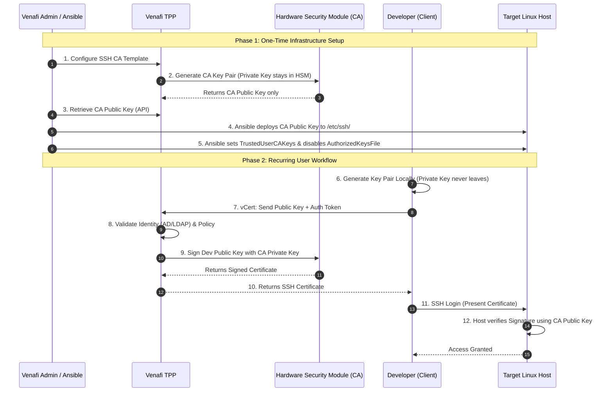

Here is the comprehensive Solution Design Document, consolidated from our discussion and the provided sources.

# Solution Design: Enterprise Transition to Short-Lived SSH Certificates via Venafi TPP

## 1. Problem Statement & Risk Assessment
The enterprise currently relies on static, unencrypted SSH private keys for authentication. This model introduces significant security risks:
*   **Lateral Movement:** If an intruder compromises a single host, they can harvest private keys and use the `known_hosts` file to identify and access other systems (lateral movement).
*   **Permanent Access:** Static keys often lack expiration dates, meaning compromised credentials remain valid indefinitely until manually revoked.
*   **Lack of Attribution:** Static keys often lack metadata, making it difficult to audit the specific identity (human or machine) using the key.

## 2. Solution Overview
The proposed solution implements a **Centralized SSH Certificate Authority (CA)** using Venafi Trust Protection Platform (TPP). Instead of distributing static public keys to individual servers, all target hosts are configured to trust the Venafi CA.
*   **Trust Model:** Centralized trust via CA; servers verify the CA's signature on the user's certificate rather than checking a list of authorized keys.
*   **Credential Lifespan:** Users receive short-lived certificates (e.g., 4 hours), ensuring access expires automatically without manual cleanup.
*   **Key Security:** User private keys are generated locally on the client and never transmitted across the network.

---

## 3. Implementation Phases

### Phase 1: Configure Venafi TPP as the SSH Certificate Authority
This phase establishes the "Root of Trust" within the Venafi platform.

1.  **Enable SSH Components:** In the Venafi Configuration Console (VCC), ensure the **SSH Key Detection and Remediation** and **SSH Certificate Lifecycle and Monitoring** components are enabled.
2.  **Establish CA Key Pair:** Generate the CA key pair. For maximum security, this should be generated and stored in a Hardware Security Module (HSM) using Venafi Advanced Key Protect, ensuring the CA private key is never exposed.
3.  **Create Issuance Templates:** Configure **SSH Certificate Issuance Templates** in the Policy Tree.
    *   **Principals:** Define allowed usernames (principals) that can be included in the certificate (e.g., `root`, `ubuntu`, or specific AD users).
    *   **Constraints:** Set strict validity periods (e.g., 4 hours) and restrict extensions like port forwarding if necessary.

### Phase 2: Host Remediation (Ansible Automation)
Use Ansible to configure target hosts to trust the Venafi CA and disable legacy access methods.

**Step 2.1: Retrieve CA Public Key**
The Ansible controller must retrieve the CA *Public* Key from Venafi to distribute it to hosts. This can be done via the WebSDK endpoint:
`GET SSHCertificates/Template/Retrieve/PublicKeyData`.

**Step 2.2: Ansible Playbook Tasks**
The playbook performs the following actions on all target hosts:

*   **Task 1: Deploy Trust Anchor:** Copy the CA public key to `/etc/ssh/trusted-user-ca-keys.pub`.
*   **Task 2: Configure Trust:** Update `/etc/ssh/sshd_config` to reference the CA key:
    `TrustedUserCAKeys /etc/ssh/trusted-user-ca-keys.pub`.
*   **Task 3: Disable Static Keys (Closing the Backdoor):** Prevent the use of old static keys by modifying `AuthorizedKeysFile`. Setting this to `none` (or `/dev/null`) forces the server to ignore `~/.ssh/authorized_keys` files, effectively closing the backdoor.
    *   *Configuration:* `AuthorizedKeysFile none`
*   **Task 4: Restart SSHD:** Restart the SSH daemon to apply changes.

### Phase 3: Secure Client-Side Workflow (Developer Access)
To ensure private keys are never exposed or downloadable by others, developers must use a **Client-Side Generation** workflow.

**The "No-Download" Policy:**
The private key is generated on the developer's local machine (or hardware token) and **never leaves that device**. Only the public key is sent to Venafi for signing.

**Automation Tool:**
Use the Venafi **vCert CLI** to automate the request process.

1.  **Authenticate:** The developer authenticates to Venafi TPP (integrated with AD/LDAP) to obtain an access token.
    `vcert getcred -u https://tpp.company.com ...`
2.  **Enrollment:** The developer runs the enrollment command. vCert generates a key pair locally, sends the public key to Venafi, and receives the signed certificate.
    ```bash
    vcert sshenroll --template "Developer-Access" --key-file "~/.ssh/id_rsa_venafi" --cert-file "~/.ssh/id_rsa_venafi-cert.pub" --validity "4h"
    ```
    *Note: The private key remains on the client's disk (or in memory if using ssh-agent integration) and is never transmitted*.

---

## 4. Workflow Diagram
This diagram illustrates the separation of duties and the flow of trust.



## 5. Security & Hardening Controls

| Control | Description | Benefit |
| :--- | :--- | :--- |
| **Short-Lived Certificates** | Certificates expire automatically (e.g., 4 hours). | Mitigates risk of stolen credentials; eliminates need for revocation lists for user keys. |
| **Principal Restrictions** | Certificates effectively whitelist which user accounts can be accessed (e.g., `ubuntu` vs `root`). | Enforces Least Privilege; prevents a developer from logging in as root unless explicitly authorized. |
| **Force Command** | Embeds specific commands in the certificate that run upon login. | Limits users to specific tasks (e.g., restricted shell) regardless of what they try to run. |
| **Source Address Restriction** | Binds the certificate to a specific source IP. | Prevents a stolen certificate from being used outside the corporate VPN or bastion host. |
| **Disable `AuthorizedKeysFile`** | Set `AuthorizedKeysFile none` in `sshd_config`. | **Closes the backdoor.** Attackers cannot add their own static keys to maintain persistence. |

## 6. preventing "Trust on First Use" (TOFU)
To fully secure the connection, the clients must also verify the Host's identity to prevent Man-in-the-Middle attacks.

1.  **Issue Host Certificates:** Use Venafi to issue a Host Certificate to each server, identifying it by its FQDN.
2.  **Client Trust:** Configure developer laptops to trust the Venafi Host CA Public Key by adding it to their `known_hosts` file with the `@cert-authority` marker.
    *   *Entry:* `@cert-authority *.your-domain.com ssh-rsa AAAAB3...`
3.  **Result:** SSH clients automatically verify the server's identity via the CA signature, eliminating the "Are you sure you want to connect?" prompt.
