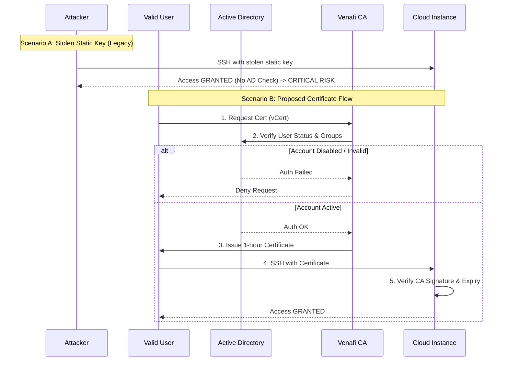

Here is a new Solution Design Document addressing the specific risk of disassociated SSH keys and AD accounts in your cloud environment.

# Solution Design: Binding SSH Access to Active Directory Identity via Short-Lived Certificates

## 1. Problem Statement & Risk Assessment
**Identified Vulnerability:**
During a security assessment, the team discovered that static SSH keys used for cloud resource access are not cryptographically bound to Active Directory (AD) user accounts.
*   **The Attack Vector:** An attacker who steals a valid SSH private key can authenticate to production systems as the target user (e.g., `ec2-user`, `ubuntu`, or a generic service account) without triggering AD authentication logs or traversing the Identity Provider (IdP).
*   **The Gap:** There is no "live" check against the user's employment status or group membership at the moment of SSH connection. A disabled AD account does not automatically revoke the associated static SSH key.

## 2. Solution Overview
The proposed solution eliminates the gap between identity (AD) and access (SSH) by implementing **Identity-Bound SSH Certificates**. Instead of trusting static keys, cloud instances will trust a Venafi SSH Certificate Authority (CA).

Users must authenticate against Active Directory to receive a short-lived SSH certificate. This certificate acts as a temporary "passport" that cryptographically links the user's AD identity to the SSH session. If the user is disabled in AD, they cannot obtain a certificate, denying access immediately.

## 3. Architecture & Trust Model

### 3.1 Trust Chain Components
1.  **Identity Provider (IdP):** Active Directory (AD) serves as the single source of truth for user status and group membership.
2.  **SSH Certificate Authority (CA):** Venafi Trust Protection Platform (TPP) acts as the CA. It is the only entity trusted by the cloud target hosts.
3.  **Client (User):** Developers/Admins use the Venafi `vCert` CLI to request certificates.
4.  **Target (Cloud Host):** Linux instances configured to trust the Venafi CA public key.

### 3.2 The Logic Flow
*   **Before:** Host trusts Key `A`. User holds Key `A`. (No AD check involved).
*   **After:** Host trusts Venafi CA. User authenticates to Venafi (via AD) $\rightarrow$ Venafi issues Cert `B` (valid for 1 hour) $\rightarrow$ User presents Cert `B` to Host $\rightarrow$ Access Granted.

---

## 4. Implementation Steps

### Phase 1: Configure Identity-Driven Issuance Templates (Venafi TPP)
We must configure Venafi to query AD before issuing a certificate.

1.  **AD Integration:** Ensure Venafi TPP is connected to the corporate Active Directory via the Identity Tree.
2.  **Create "Production Access" Template:**
    *   **Issuance Flow:** Configure the template to require AD authentication.
    *   **Principal Mapping:** Instead of allowing users to request any principal, map AD Group Membership to SSH Principals.
        *   *Logic:* If User is in AD Group `Cloud-Admins`, allow principal `root` or `admin`.
        *   *Logic:* If User is in AD Group `Developers`, allow principal `dev-user` only.
    *   **Validity Period:** Set to **1 Hour**. This ensures that if an AD account is disabled, access is revoked within 60 minutes max.

### Phase 2: Host Hardening (Cloud Instances)
We need to configure cloud instances to trust the Venafi CA and verify principals.

**Configuration Steps (via Ansible/User-Data):**
1.  **Install CA Public Key:** Place the Venafi CA public key at `/etc/ssh/trusted-user-ca-keys.pub`.
2.  **Update `sshd_config`:**
    ```bash
    # Trust the Venafi CA
    TrustedUserCAKeys /etc/ssh/trusted-user-ca-keys.pub

    # Mandatory: Deny static keys to force AD-check via Certificate
    AuthorizedKeysFile none

    # Verify the certificate belongs to the user trying to log in
    # (Optional but recommended for granular control)
    AuthorizedPrincipalsFile /etc/ssh/auth_principals/%u
    ```
3.  **Restart SSHD:** Apply changes.

### Phase 3: Client Workflow (The "Link")
This workflow enforces the AD association every time a user wants to connect.

1.  **Authentication:** The user runs `vCert` (or a wrapper script) which prompts for AD credentials (or uses a Kerberos token/SAML token depending on TPP configuration).
    *   *Command:* `vcert getcred -u https://tpp.corp.local --username <AD_User> --password <AD_Pass>`
    *   *Result:* If AD account is disabled, this step fails. **Access Denied.**
2.  **Request:** If authenticated, `vCert` requests a certificate.
    *   *Command:* `vcert sshenroll --template "Production-Access" ...`
3.  **Connection:** User connects using the signed certificate.
    *   *Command:* `ssh -i id_rsa -i id_rsa-cert.pub user@cloud-host`

---

## 5. Security Controls & Auditability

| Risk Scenario | Current State (Static Keys) | New State (Venafi SSH Certs) |
| :--- | :--- | :--- |
| **Stolen Private Key** | Attacker has permanent access until key is manually found and removed. | Attacker has access for **max 1 hour** (certificate expiry). |
| **Terminated Employee** | Key remains valid on servers; ex-employee can still login. | User cannot authenticate to Venafi TPP (AD disabled); cannot get cert; **access denied**. |
| **Lateral Movement** | Stolen key allows jumping to any host trusting that key. | Certificate principals restrict which hosts/users can be accessed. |
| **Audit Trail** | Logs only show "public key accepted" (generic). | Venafi logs show **who** (AD User) requested the cert, **when**, and **for which host**. |

## 6. Addressing the "Lack of Association"
This design directly resolves the finding:
1.  **Association Enforced:** The SSH credential (certificate) is only generated *after* successful authentication against the AD User Account.
2.  **Binding:** The Certificate Subject/KeyID is logged, creating a definitive link between the ephemeral SSH access and the persistent AD identity.
3.  **Revocation:** Disabling the AD account effectively revokes SSH access immediately (preventing new cert issuance) and fully (once the current short-lived cert expires).

## 7. Diagram: Identity-Bound Access Flow


