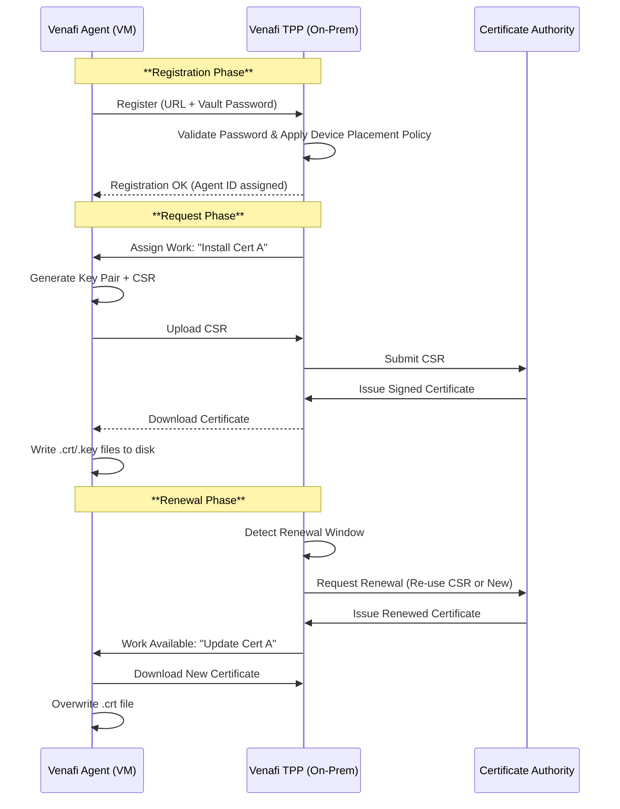

This Solution Design Document (SDD) outlines the architecture, deployment, and operational workflows for integrating Venafi Machine Identity Management using the Venafi Trust Protection Platform (TPP) and Venafi Server Agent.

This design specifically addresses the requirement to deploy agents via Ansible/Image pipelines while highlighting the operational gap regarding post-installation tasks (service restarts/permission changes).

---

# Solution Design Document: Venafi Agent & TPP Integration

| **Project** | Enterprise Machine Identity Management |
| --- | --- |
| **Component** | Venafi Trust Protection Platform (TPP) & Server Agent |
| **Version** | 1.0 |
| **Status** | Draft |

## 1. Executive Summary

This solution provides a scalable method for issuing and renewing TLS certificates on endpoints (EC2/VMware) using the Venafi Server Agent. The agent will be provisioned automatically (via "baked" images or Ansible), authenticate to the on-premise Venafi TPP using Vault-managed credentials, and continuously monitor/renew assigned certificates.

**Key Constraint:** The Venafi Agent will handle *certificate placement only*. Post-processing steps (restarting services, granular permission hardening) are out of scope for the Agent and must be handled by external automation (Ansible/Cron), listed under "Drawbacks & Limitations."

---

## 2. Solution Architecture

The architecture follows a **Hub-and-Spoke** model where the Venafi TPP (Hub) manages policies and communicates with the Certificate Authority (CA), while Venafi Agents (Spokes) installed on target servers poll the TPP for work.

### High-Level Component Interaction

1. **Target Node (EC2/VM):** Hosts the Venafi Agent.
2. **Ansible/Provisioning Layer:** Installs agent, injects configuration (`ved_agent.ini`), and retrieves secrets from Vault.
3. **HashiCorp Vault:** Stores the `Registration Password` required for the agent to trust and register with TPP.
4. **Venafi TPP (On-Prem):** Accepts registration, assigns "Work" (Certificate issuance), and interfaces with the CA (e.g., DigiCert, MS CA).
5. **Certificate Authority (CA):** Signs the CSRs generated by the Agent.

---

## 3. Deployment Strategy

We support two patterns for agent deployment. Both result in an active agent checking into TPP.

### Option A: Immutable Infrastructure (Baked Image)

* **Method:** Install the Venafi Agent binary into the Gold Image (EC2 AMI / VMware Template).
* **State:** The agent service is set to `Disabled` or `Manual` in the image.
* **Activation:** On boot, a `User Data` script (Cloud-Init) or Ansible callback starts the service and injects the specific runtime credentials.
* **Pro:** Faster boot times; binary is pre-verified.

### Option B: Just-in-Time Provisioning (Ansible)

* **Method:** Ansible connects to a bare OS after provisioning.
* **Process:**
1. Ansible authenticates to **Vault** to retrieve the Venafi TPP User/Password or Registration Token.
2. Ansible downloads the Venafi Agent `.msi` or `.rpm/deb`.
3. Ansible installs the package.
4. Ansible configures `ved_agent.ini` with TPP URL and Credentials.
5. Ansible starts the Agent service.


---

## 4. Configuration Details

### 4.1. Credential Injection (Ansible + Vault)

Ansible serves as the bridge. It pulls the sensitive "Registration Password" from Vault and injects it into the agent's registration command.

**Ansible Task Example (Conceptual):**

```yaml
- name: Retrieve Venafi Registration Password from Vault
  hashivault_secret:
    path: "secret/venafi/agent_registration"
    key: "password"
  register: venafi_secret

- name: Configure and Start Venafi Agent
  command: >
    /opt/venafi/agent/bin/vagent -m
    server_url=https://venafi-tpp.internal.corp:443/vedclient
    registration_password="{{ venafi_secret.value }}"
    -s

```

### 4.2. Agent Configuration

The agent communicates via the VED Client protocol (HTTPS).

* **Configuration File:** `/opt/venafi/agent/data/ved_agent.ini` (Linux) or Registry (Windows).
* **Critical Settings:**
* `Address`: The URL of the TPP server (e.g., `https://tpp.company.com/vedclient`).
* `Force Rotation`: Ensures the agent checks in immediately after install.


---

## 5. Certificate Lifecycle Workflows

### 5.1. Workflow: Agent Registration & Certificate Request

How a new machine gets its first certificate.

1. **Agent Start:** Service starts and sends a "Registration Request" to TPP URL with the injected password.
2. **Device Placement:** TPP validates the password. Based on the machine's hostname or IP, TPP places the agent into a specific **Policy Folder** (e.g., `\VED\Policy\WebServers`).
3. **Work Assignment:** The Policy Folder contains a "Certificate Device" object. TPP assigns "Installation Work" to the agent.
4. **CSR Generation:** The Agent generates a Key Pair and CSR *locally* on the server (ensuring the Private Key never leaves the server, if configured for "Local Generation").
5. **Upload:** Agent sends the CSR to TPP.
6. **Signing:** TPP submits CSR to the configured CA (e.g., DigiCert).
7. **Download:** CA returns the Cert to TPP. TPP holds it.
8. **Placement:** On the next heartbeat (check-in), the Agent downloads the Signed Certificate and writes it to the file path defined in the Policy (e.g., `/etc/ssl/certs/app.crt`).

### 5.2. Workflow: Certificate Renewal

How an existing certificate is rotated before expiration.

1. **Monitoring:** TPP tracks the expiration date.
2. **Trigger:** When the certificate enters the "Renewal Window" (e.g., 30 days before expiry), TPP auto-initiates the renewal process with the CA.
3. **Issuance:** The CA issues the *new* certificate to TPP.
4. **Work Queued:** TPP flags the Agent: "New Certificate Available."
5. **Check-In:** Agent polls TPP (default interval is often 60 mins).
6. **Overwrite:** Agent downloads the new cert and overwrites the old `.crt` file on the disk.

**Diagram: Request & Renewal Flow**



---

## 6. Drawbacks & Limitations

As requested, the following are distinct limitations of the Venafi Agent architecture that must be accounted for in the Operational Design.

| Limitation | Description | Impact | Mitigation Strategy |
| --- | --- | --- | --- |
| **No Native Service Restarts** | The Agent writes the certificate file to disk but **cannot** reliably restart the consuming service (IIS, Nginx, Apache, Tomcat). | The application will continue serving the *old* certificate loaded in memory, causing an outage when the old cert expires, even though the new file is on the disk. | **File Watchers:** Run a cron job/systemd path unit that watches the `.crt` file for modification timestamps and triggers a service reload.<br>

<br>**Ansible Schedule:** Run an Ansible playbook daily to check for cert changes and reload services. |
| **Limited Permission Management** | The Agent creates files with default system permissions (often owned by root/LocalSystem). It cannot apply complex ACLs or change ownership to a specific service user (e.g., `www-data`). | Services running as non-privileged users may be unable to read the new private key, causing startup failures. | **Post-Install Scripts:** Use a wrapper script or Ansible to `chown` and `chmod` the certificate files immediately after the Agent writes them. |
| **Polling Latency** | The Agent uses a "Pull" mechanism. It does not receive the certificate instantly. | There is a delay (up to the heartbeat interval) between issuance and installation. | Configure the heartbeat interval to be shorter (e.g., 15 mins) during critical deployment windows, or manually force a check-in using `vagent -f`. |

---

## 7. Sources & References

* **Agent Installation & Configuration:** [Venafi Server Agent Installation Guide](https://www.google.com/search?q=https://docs.venafi.com/Docs/current/TopNav/Content/Agent/t-agent-installing-c.php)
* **Device Placement (Policy Mapping):** [Venafi Device Placement & Dynamic Provisioning](https://www.google.com/search?q=https://docs.venafi.com/Docs/current/TopNav/Content/Provision/c-provision-certs-agent-DynamicProvisioning-about.php)
* **Agent Communication Protocols:** [Venafi VED Client Protocol Documentation](https://www.google.com/search?q=https://docs.venafi.com/Docs/current/TopNav/Content/Agent/c-agent-communication-c.php)
* **Ansible Venafi Collection (Official):** [Ansible Galaxy - Venafi Machine Identity](https://galaxy.ansible.com/venafi/machine_identity)
