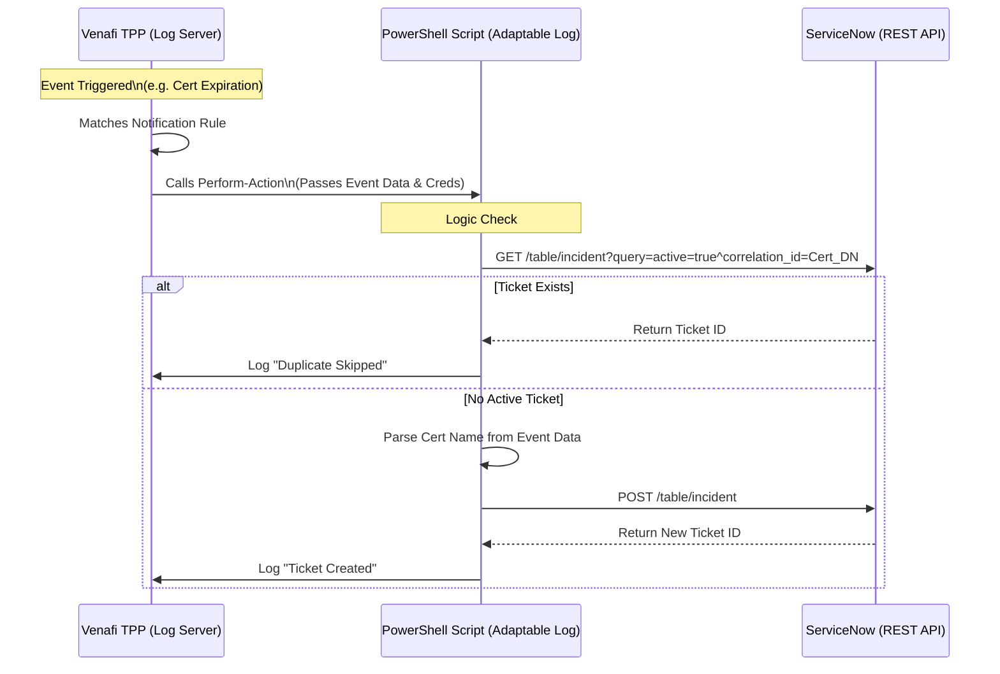

Here is the Solution Design Document for integrating Venafi Trust Protection Platform (TPP) with ServiceNow using the Adaptable Log Channel.

---

# Solution Design: Venafi TPP to ServiceNow Integration via Adaptable Log Channel

## 1. Executive Summary

This solution leverages the **Venafi Adaptable Log Channel** to automatically create Incidents or Catalog Tasks in ServiceNow (SNOW) when specific events occur in Venafi TPP (e.g., Certificate Expiration, Validation Failures). The integration uses a server-side PowerShell script triggered by Venafi’s Log Server to make REST API calls to ServiceNow.

## 2. Architecture Diagram



---

## 3. Prerequisites

| Component | Requirement |
| --- | --- |
| **Venafi TPP** | Version 20.x or higher with "Adaptable Log Channel" driver license. |
| **Server Access** | RDP access to the Venafi TPP server to place the script file. |
| **ServiceNow** | A Service Account with `itil` or `sn_incident_write` roles (or ability to write to the target table). |
| **Network** | The Venafi TPP server must have outbound HTTPS (443) access to the ServiceNow instance URL. |

---

## 4. Implementation Details

### A. Script Location & Naming

* **Directory:** The PowerShell script **must** be placed in the following directory on the Venafi TPP server:
`C:\Program Files\Venafi\Scripts\AdaptableLog`
* **File Extension:** Must be `.ps1`.
* **Naming Convention:** Use a descriptive name, e.g., `ServiceNow_Incident_Creation.ps1`.
* *Note:* After placing the file, you must restart the Venafi Log Server service or "Save" the Adaptable Log Channel object in the console to force a refresh.


### B. Credential Management (Security Best Practice)

**Do NOT hardcode credentials in the script.**

1. **Create a Credential Object:** In Venafi TPP, create a `Username Credential` object containing the ServiceNow Service Account username and password.
2. **Assign to Channel:** In the Adaptable Log Channel configuration (Venafi Configuration Console > Logging > Channels), select this credential object in the **"Credential"** field.
3. **Access in Script:** The Venafi driver automatically passes these credentials to the script inside the `$General` hashtable.
* Username: `$General.UserName`
* Password: `$General.UserPass` (passed as a plain text string by the driver at runtime).


### C. Duplicate Prevention Strategy

To prevent flooding ServiceNow with tickets for the same certificate (e.g., daily expiration warnings), implement a **"Check then Act"** logic in the PowerShell script:

1. **Correlation ID:** Use the Certificate's Distinguished Name (DN) as the `correlation_id` in ServiceNow.
2. **Logic:**
* Before creating a ticket, the script sends a `GET` request to the ServiceNow Table API.
* **Query:** `active=true^correlation_id=$Event.Component`
* **Decision:** If the API returns any records, the script exits (logs "Duplicate found"). If 0 records, it proceeds to `POST` a new ticket.


### D. Passing Certificate Name (Parsing Logic)

The Venafi Event data is passed to the script in the `$Event` hashtable.

* **`$Event.Component`**: Contains the full Venafi DN (e.g., `\VED\Policy\Certificates\Internal\web.example.com`).
* **Extraction:** You must split this string to get the Common Name (CN) for the description.

---

## 5. Script Solution Design (PowerShell)

Below is the logic structure for the `Perform-Action` function required by Venafi.

```powershell
# Function MUST be named Perform-Action
function Perform-Action {
    Param(
        [System.Collections.Hashtable]$General, # Contains Creds & Config
        [System.Collections.Hashtable]$Event,   # Contains Log Data (ID, Component, Message)
        [System.Collections.Hashtable]$Extra    # Custom fields
    )

    # 1. Setup Auth Headers using safe credentials passed from TPP
    $User = $General.UserName
    $Pass = $General.UserPass
    $Pair = "$($User):$($Pass)"
    $Bytes = [System.Text.Encoding]::ASCII.GetBytes($Pair)
    $Base64 = [System.Convert]::ToBase64String($Bytes)
    $Headers = @{ Authorization = "Basic $Base64" }

    # 2. Extract Certificate Name (CN) from the Component DN
    # Example DN: \VED\Policy\Certificates\Server\www.google.com
    $CertDN = $Event.Component
    $CertName = $CertDN -split '\\' | Select-Object -Last 1

    # 3. Define ServiceNow Endpoint
    # Using Text1 from Channel Config as the Instance URL to avoid hardcoding
    $SNOW_Instance = $General.Text1 
    $Uri = "https://$SNOW_Instance/api/now/table/incident"

    # 4. DUPLICATE CHECK: Query for active incidents with this Cert DN
    try {
        $Query = "active=true^correlation_id=$CertDN"
        $CheckUri = "$Uri?sysparm_query=$Query"
        $Existing = Invoke-RestMethod -Uri $CheckUri -Method Get -Headers $Headers
        
        if ($Existing.result.Count -gt 0) {
            # Ticket exists, do nothing
            return "Skipped: Active ticket exists for $CertName"
        }
    }
    catch {
        return "Error checking duplicates: $($_.Exception.Message)"
    }

    # 5. Create Payload
    $Body = @{
        short_description = "Venafi: Certificate Expiry Warning - $CertName"
        description       = "The certificate $CertName ($CertDN) is expiring. `nEvent: $($Event.Description)"
        caller_id         = "venafi_service_account"
        correlation_id    = $CertDN  # Crucial for de-duplication
        impact            = "2"
        urgency           = "2"
    } | ConvertTo-Json

    # 6. Send to ServiceNow
    try {
        $Response = Invoke-RestMethod -Uri $Uri -Method Post -Headers $Headers -Body $Body -ContentType "application/json"
        return "Success: Created Incident $($Response.result.number)"
    }
    catch {
        return "Failed: $($_.Exception.Message)"
    }
}

```

---

## 6. Configuration Steps

### Step 1: Place the Script

1. Copy the code above into a file named `VenafiToSNOW.ps1`.
2. Save it to `C:\Program Files\Venafi\Scripts\AdaptableLog\` on the TPP server.

### Step 2: Configure Venafi Channel

1. Open **Venafi Configuration Console** (or Web Admin).
2. Navigate to **Logging > Channels**.
3. Create a new **Adaptable Log Channel**.
4. **Settings:**
* **PowerShell Script:** Select `VenafiToSNOW.ps1` from the dropdown.
* **Credential:** Select your ServiceNow credential object.
* **Text 1:** Enter your ServiceNow instance URL (e.g., `dev12345.service-now.com`).
* **Concurrent Operations:** Set to `1` (Recommended to prevent race conditions on duplicates).


### Step 3: Create Notification Rule

1. Navigate to **Logging > Notification Rules**.
2. Create a new rule.
3. **Target Channel:** Select the Adaptable Channel created in Step 2.
4. **Rule Criteria:**
* *Severity:* Critical / Error.
* *Event ID:* Select specific IDs (e.g., `Default SQL Channel` log events like "Certificate Expiration" or ID `10005`).


5. **Save** to activate.

### Step 4: Validate

1. Trigger a test event (e.g., manually expire a dummy certificate or use the "Test Notification" feature if available).
2. Check the Venafi `Default SQL Channel` logs for the output of your script (it logs the `return` string from the function).
3. Verify the Incident appears in ServiceNow.
